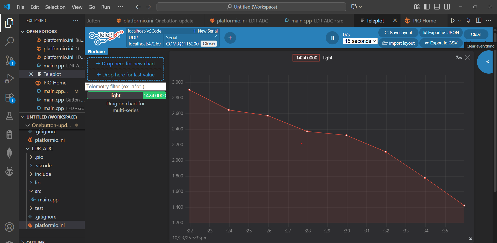

# Dự án Kiểm tra Quang trở (LDR) với ESP32 trên PlatformIO

## Mô tả sơ lược
Dự án này sử dụng ESP32 để đọc giá trị độ sáng tương đối từ quang trở (LDR) qua chân ADC (GPIO34). Giá trị được in ra cổng UART dưới dạng số nguyên (0-4095) và gửi ở định dạng phù hợp để vẽ đồ thị thời gian thực sử dụng extension Teleplot trong VS Code. Dự án được xây dựng trên PlatformIO, giúp kiểm tra hoạt động của LDR trong thiết kế phần cứng.

### Yêu cầu
- Board ESP32 (ví dụ: ESP32 DevKit).
- LDR nối với mạch phân áp (10kΩ resistor) đến GPIO34.
- VS Code với extension PlatformIO và Teleplot.
- Arduino framework.

### Cấu trúc file
- `platformio.ini`: Cấu hình dự án.
- `src/main.cpp`: Code chính đọc ADC và in ra serial.

### Hướng dẫn chạy
1. Clone repo này.
2. Mở trong VS Code với PlatformIO.
3. Build và upload code.
4. Mở Serial Monitor để xem giá trị.
5. Mở Teleplot, kết nối serial port, và xem đồ thị (dữ liệu gửi dạng "light:value" hoặc "timestamp,light:value").

### Ảnh chụp màn hình đồ thị
Dưới đây là đồ thị cường độ sáng theo thời gian thực (giá trị cao hơn khi môi trường tối hơn):

### Lưu ý
- Giá trị ADC phụ thuộc vào độ sáng: Thử che LDR để thấy thay đổi.
- Nếu chân ADC khác, chỉnh sửa `#define LDR_PIN` trong main.cpp.

### Cập nhật lần cuối
Dự án được cập nhật lần cuối vào ngày 23/10/2025.

